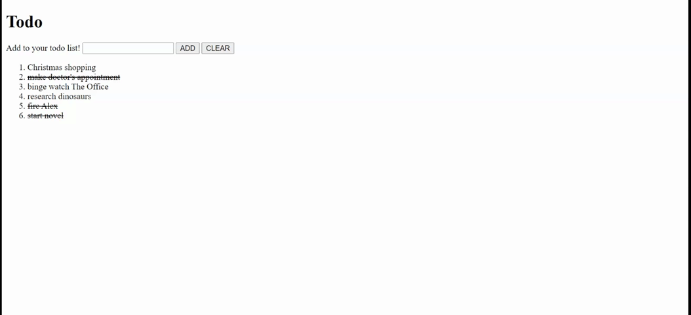

# ToDOM

---

---

Instructions in `main.js` as inline code to document your functions with.

### Stretch Goals

* Make it so that when a todo item is clicked, its completness is toggled. This should both set the todo item's `'complete'` to `true` in the global todos array as well as toggle a strikethrough style on the todo element on the DOM.
* [Bootstrap it up!](https://getbootstrap.com/) There are many elements that could be given the bootstrap treatment, whether it's the todo `li`, or the heading, or the input form and buttons. Alternately, pretty it up with [Semantic UI](https://semantic-ui.com/) or [Materialize](https://materializecss.com/) or the component system of your choice.
* Filter your todos! Add a button to the DOM for Delete Completed, and wire up a click event listener for it that filters the `todos` array by whether the item is complete or not. Reassign the `todos` array (you may need to change it to be `let`-declared) to hold that filtered array, and you've got it!
* Filter your todos NON-DESTRUCTIVELY. That means that there should be a button (in addition to the previous stretch goal's button?) called "Show Only Incomplete" that, rather than _delete_ the items, simply makes a NEW filtered array and displays only that one. Make sure you can still add new todos and have them display. You may also want another button for Show All Todos, when you can go back to displaying your larger set of data. This one's tricky, for sure, but if you walk through the logic (a flow-chart can DEFINITELY help here!) you can get it.
